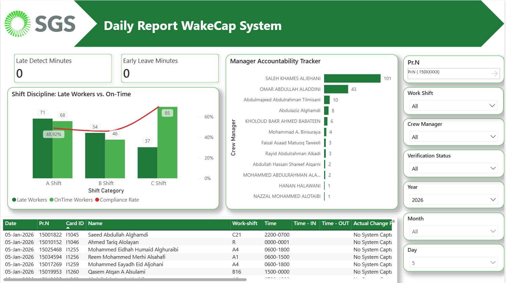

# 📊 Operations & IoT Data Dashboards

## Project Overview
This repository showcases a collection of professional business intelligence dashboards developed to transform raw operational data into actionable insights. The primary focus is on **airport ground services (SGS)** and **IoT workforce monitoring**.

## 🛠 Tech Stack
* [cite_start]**Tools:** Power BI Desktop [cite: 59]
* [cite_start]**Automation:** Power Automate (ETL Pipelines) [cite: 12]
* [cite_start]**Data Sources:** WakeCap IoT Sensors, Attendance Logs, SharePoint [cite: 13, 12]
* [cite_start]**Database/Storage:** CSV, Excel, [cite: 51, 58]

---

## 📈 Featured Dashboards

### 1. SGS Workforce Productivity & Safety (IoT)
Designed to analyze **WakeCap IoT data** to monitor worker presence and safety readiness in real-time.
* [cite_start]**Key Metrics:** Active vs. Inactive hours, Hardware health (Battery/Connectivity), and Safety compliance[cite: 16, 13].
* [cite_start]**Impact:** Improved workforce productivity insights and ensured equipment operational readiness[cite: 13, 16].

> **📷 Dashboard Preview:**
> 
> 

### 2. Operational Performance & Undelivered Hours
[cite_start]A management-ready dashboard focused on airport ground operation gaps[cite: 15].
* [cite_start]**Features:** Scalable data models to track **Undelivered Hours** and operational performance gaps[cite: 14].
* [cite_start]**Automation:** Integrated with automated ETL pipelines for 100% hands-free daily reporting[cite: 12].

---

## 🚀 Key Achievements
* [cite_start]**Automation:** Fully automated the data refresh cycle using **Power Automate**, saving hours of manual work daily[cite: 12].
* **Data Modeling:** Built complex DAX measures to handle large-scale IoT datasets efficiently.
* [cite_start]**Decision Support:** Provided management with clear visuals to support data-driven decisions in airport operations[cite: 15].

---
